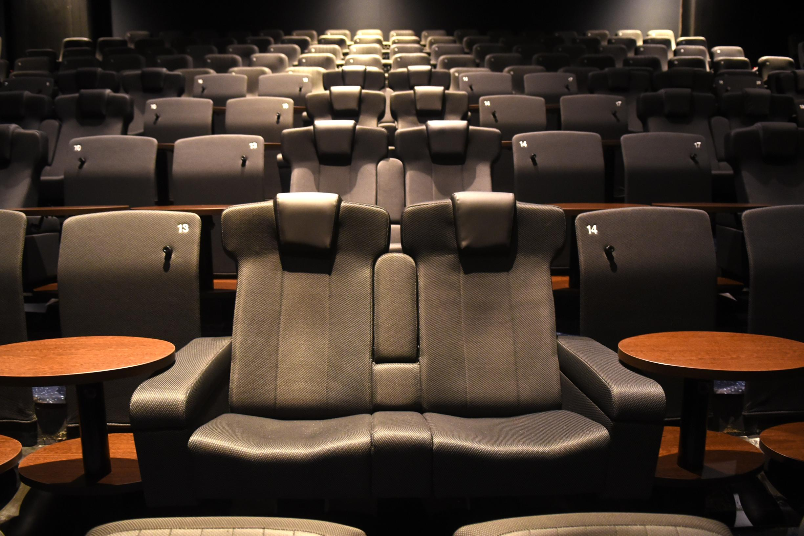
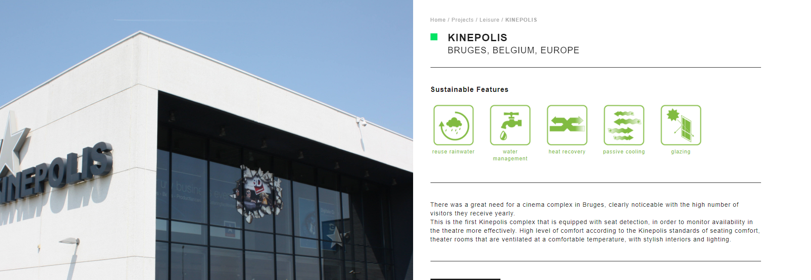

# Analyse

Seat detection wordt reeds gebruikt in verscheidenheid aan situaties zoals bijvoorbeeld de Kinepolis om te checken of iedereen op zijn juiste stoel zit of wel voor zijn stoel heeft betaald.

De manier waarop de detectie gedaan wordt kan verschillen, de meeste gaan voor een simpel druk systeem waarbij de persoon op een soort drukplaat zit waarbij druk de indicatie geeft of er een persoon op de stoel zit.

Wij gaan voor een meer AI manier, dit is dan ook AI-Edge. We lezen de beweging van een persoon uit, mensen bewegen altijd een beetje op hun stoel (sommigen meer dan normaal). Deze beweging kunnen we uitlezing met een sensor die aan de stoel hangt.

## Resources

### Hardware

We maken gebruik van de hardware uit de [workshop](https://ai-edge-workshop.netlify.app/):

- USB-micro kabel

- USB-mini kabel

- NUCLEO_L476RG bordje

- Sensortile

- Programming Ribbon kabel

- Raspberry Pi

### Software

We maken gebruik van heel wat software, deze worden ook gerbruikt in de [workshop](https://ai-edge-workshop.netlify.app/):

- Mbed: om code te compilen en op de hardware te krijgen

- C++: om de sensor uit te lezen

- Code editor (Visual Studio Code): om code te schrijven/bewerken

- [Edge Impulse](https://www.edgeimpulse.com/): om data te samplen en daarmee een Neuraal Netwerk te maken

- Python: om de predicties via seriële communicatie uit te lezen en te verzenden over MQTT
