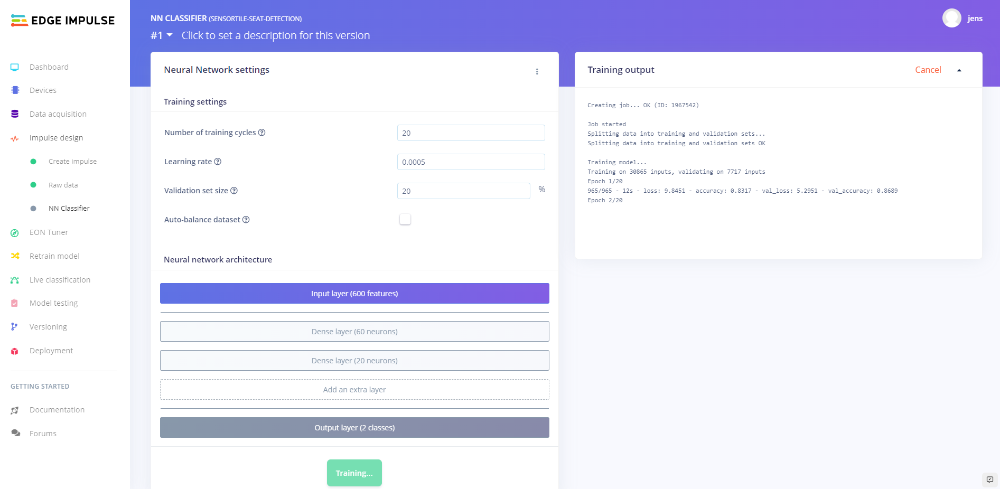
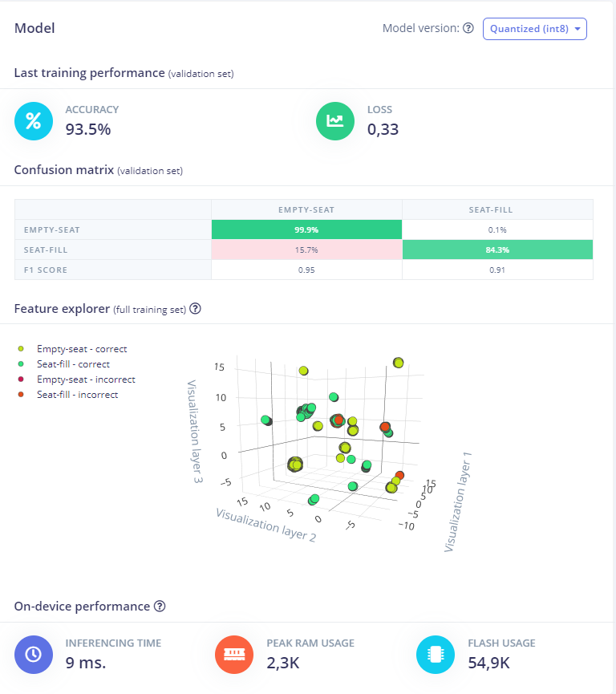
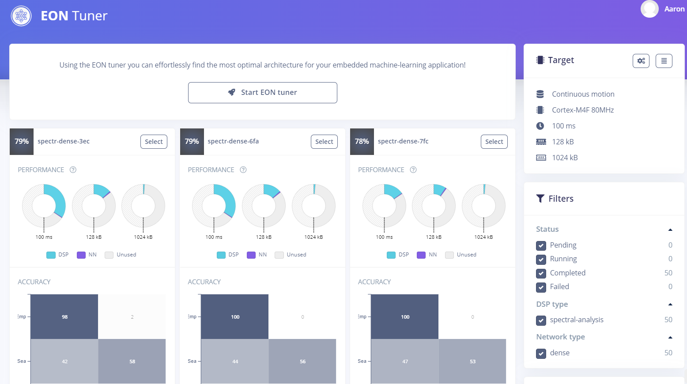
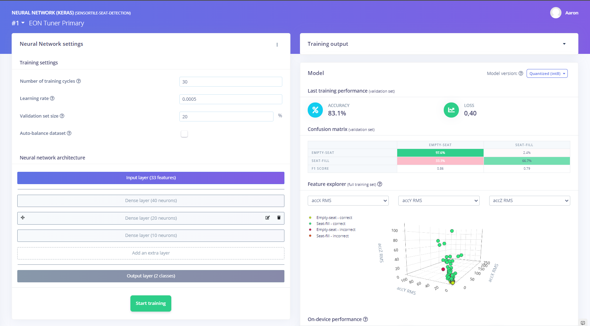
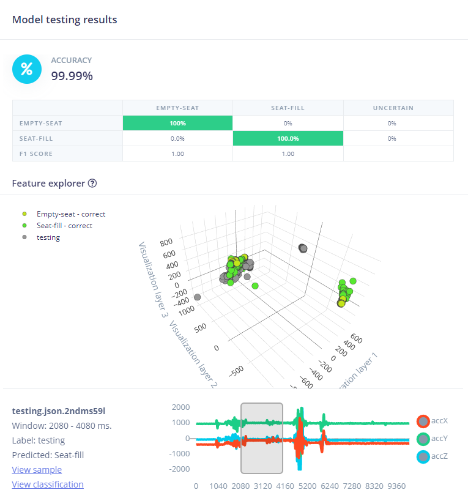

# Uitwerking

## Sensor code

We schrijven de code van de workshop op de accelerometers door dezelfde stappen te volgen van de [workshop](https://ai-edge-workshop.netlify.app/).

Via MBED compilen we de code en zetten we deze over via het STM bordje naar de accelerometer.

## Sensor uitlezen

Na de code correct over te zetten, kunnen we de X, Y & Z waarden van de sensor uitlezen via Putty.

## Sampling

Deze data zenden we naar de [Edge Impulse website](https://www.edgeimpulse.com/) via de [edge-impulse-data-forwarder](https://ai-edge-workshop.netlify.app/02-ab-writing/04-connecting-a-device/), na de sensor te registreren op Edge Impulse met de data-forwarder kunnen we beginnen met samplen.

We hangen de sensor aan een stoelpoot en meten data op.

We samplen 2 categorieën: Empty-seat en Seat-fill.

Bij "Empty-seat" laten de stoel leeg. De metingen zullen dus ook lage waarden hebben.

Bij "Seat-filled" zitten we in de stoel waarbij we soms wat bewegen en soms stil zitten. De meting zullen dus hoge pieken hebben, deze pieken zijn plotse bewegingen.

We verzamelen meer dan een uur aan data.

## Neuraal Netwerk model

We creeëren een model met de Impulse Design:

De Window size hebben we op 2 seconden en de window increase op 80ms we hebben geporbeerd met andere waarden maar dit gav niet veel verschil.

Na veel testen concludeerden we dat raw data een goed resultaat gav.

Daarna sturen we deze features door een Keras Neuraal Netwerk, dit Neuraal Network klassificeerd op de 2 klasses: "Empty-seat & "Seat-filled", dit zijn dan ook de 2 mogelijke outputs.

## trainen

we doen 20 epochs na testen gaf dit een naukeurig resultaat zonder dat we te veel last kunnen hebben van overfitting. Learningrate hebben we op de standaard waarden laten staan.

dit is het resultaat van het model:

we zien dat als de stoel leeg is hij het zo goed als altijd juist heeft, maar als hij gevuld is soms denkt dat hij leeg is. Normaal zal dit geen probleem zijn omdat we de imput gebruiken van meerdere stoelen.

## EON Tuner

De EON Tuner zorgt ervoor dat we het meest optimaal neuraal netwerk verkrijgen.

De EON Tuner test verschillende neurale netwerken met verschillende layer configuraties en zoekt de beste configuratie.

De EON Tuner geeft een aanbevolen configuratie voor het Neuraal Netwerk:

## Model testing

Na dit model te laten trainen met de data, testen we het model:

Tijdens het testen merkten we dat het model wel vrij accuraat de bezetting van stoel kon detecteren. Er kwamen wat inaccurate resultaten wanneer we ons best deden om zeer stil te zitten dat het model wat moeite had. We testen dan ook maar kleine momenten, mensen kunnen korte momenten stil zitten, maar op een langer termijn zal de persoon eens bewegen en dan zal het model wel de persoon detecteren.

## Model deployen

## Resultaat

Om nu de effectieve bezettingsgraad van een lokaal te achterhalen moet de data van alle sensortiles op een centraal punt verzameld worden. Dit zal gebeuren door de sensortile met een Raspberry Pi te verbinden. Op deze Pi draait een python programma die de de predicties van de sensortile uitleest over de seriële verbinding (hiervoor wordt de [pyserial](https://github.com/pyserial/pyserial) module gebruikt). Vervolgens zal de Pi deze waarden in een payload gieten en over MQTT versturen naar een broker.

Omdat we geen tijd genoeg hadden om in het lokaal een MQTT broker op te zetten hebben we gekozen om de publice broker [mqtthq](https://mqtthq.com/) te gebruiken. Daar kunnen al de waarden op de "SensorTile" topic uitgelezen worden.

De python code die dit allemaal realiseerd kan in de velgende github repo worden teruggevonden [mqtt-repo](https://github.com/ThomasLuca/Seat-detection-mqtt).
