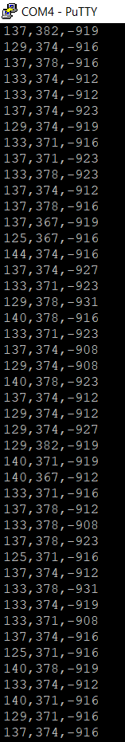
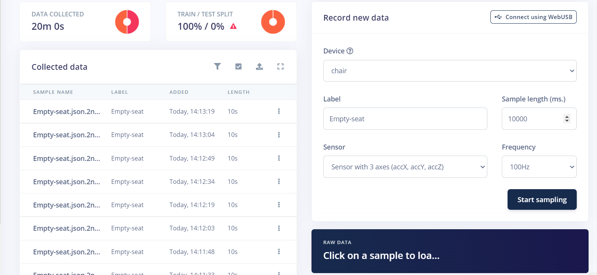
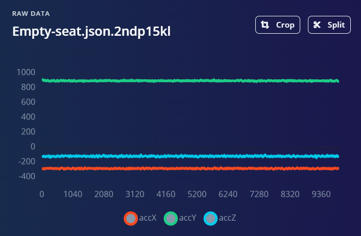
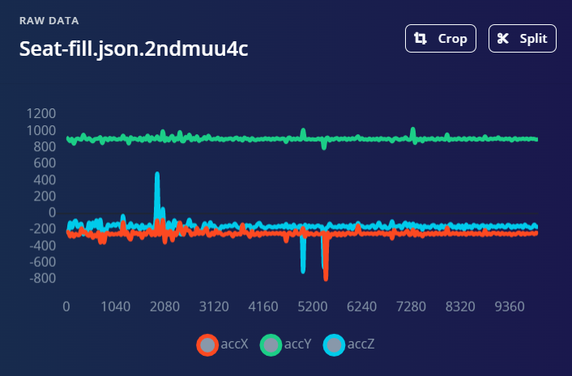
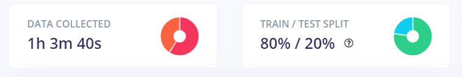
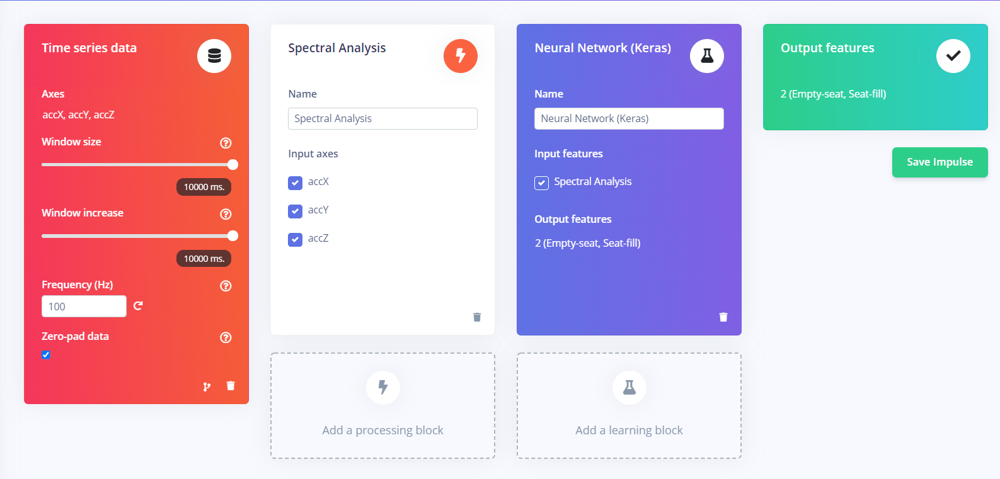

# Uitwerking

## Accelerometer code

We schrijven de code van de workshop op de accelerometers door dezelfde stappen te volgen van de [workshop](https://ai-edge-workshop.netlify.app/).

Via MBED compilen we de code en zetten we deze over via het STM bordje naar de accelerometer.

Na de code correct over te zetten, kunnen we de X, Y & Z waarden van de sensor uitlezen via Putty.

Deze data zenden we naar de [Edge Impulse website](https://www.edgeimpulse.com/) via de [edge-impulse-data-forwarder](https://ai-edge-workshop.netlify.app/02-ab-writing/04-connecting-a-device/), na de sensor te registreren op Edge Impulse met de data-forwarder kunnen we beginnen met samplen.

We hangen de sensor aan een stoelpoot en meten data op.

We samplen 2 categorieën: Empty-seat en Seat-fill.

Bij "Empty-seat" laten de stoel leeg. De metingen zullen dus ook lage waarden hebben.

Bij "Seat-filled" zitten we in de stoel waarbij we soms wat bewegen en soms stil zitten. De meting zullen dus hoge pieken hebben, deze pieken zijn plotse bewegingen.

We verzamelen meer dan een uur aan data.

We creeëren een model met de Impulse Design:

De Window size en Window increase werden automatisch ingesteld door de EON Tuner.

Na veel testen concludeerden we dat een Spectral Analysis het beste resultaat gaf. Daarna sturen we deze features door een Keras Neuraal Netwerk, dit Neuraal Network klassificeerd op de 2 klasses: "Empty-seat & "Seat-filled", dit zijn dan ook de 2 mogelijke outputs.